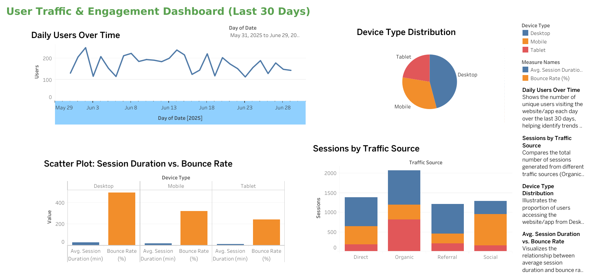

# User Traffic & Engagement Dashboard (Last 30 Days)

## Project Overview

This project visualizes user traffic and engagement data for a website/app over the last 30 days. The dashboard helps uncover usage patterns, track user engagement, and identify trends that can guide product or marketing decisions.

## Features

- **Daily Users Over Time:**  
  Shows the number of unique users visiting the website/app each day over the last 30 days, helping identify trends and peak usage periods.

- **Sessions by Traffic Source:**  
  Compares the total number of sessions generated from different traffic sources (Direct, Organic, Referral, Social), providing insights into which channels drive the most engagement.

- **Device Type Distribution:**  
  Illustrates the proportion of users accessing the website/app from Desktop, Mobile, or Tablet devices.

- **Avg. Session Duration vs. Bounce Rate:**  
  Visualizes the relationship between average session duration and bounce rate, segmented by device type, to highlight engagement patterns.

## Dataset

- **File:** `user_traffic_engagement_last_30_days.csv`
- **Columns:**
  - Date
  - Users
  - Sessions
  - Page Views
  - Avg. Session Duration (min)
  - Bounce Rate (%)
  - Traffic Source (Organic, Social, Referral, Direct)
  - Device Type (Desktop, Mobile, Tablet)

## How to Use

1. **View the Dashboard:**  
   - See the PNG or PDF export in the `dashboard_exports` folder.
2. **Recreate or Extend:**  
   - Import the CSV file into Tableau or your preferred data visualization tool to explore or extend the analysis.
3. **Customize:**  
   - Adjust filters, add new charts, or update the dataset as needed for your own analysis.

## Tools Used

- **Data Preparation:** Python, Excel
- **Visualization:** Tableau
- **Documentation:** Markdown, GitHub

## Key Insights

- Most users visit the website/app mid-week, with noticeable dips on weekends.
- Organic traffic is the largest source of sessions, followed by direct and referral.
- Desktop remains the most popular device, but mobile usage is significant.
- Higher bounce rates are observed on mobile devices compared to desktop.

